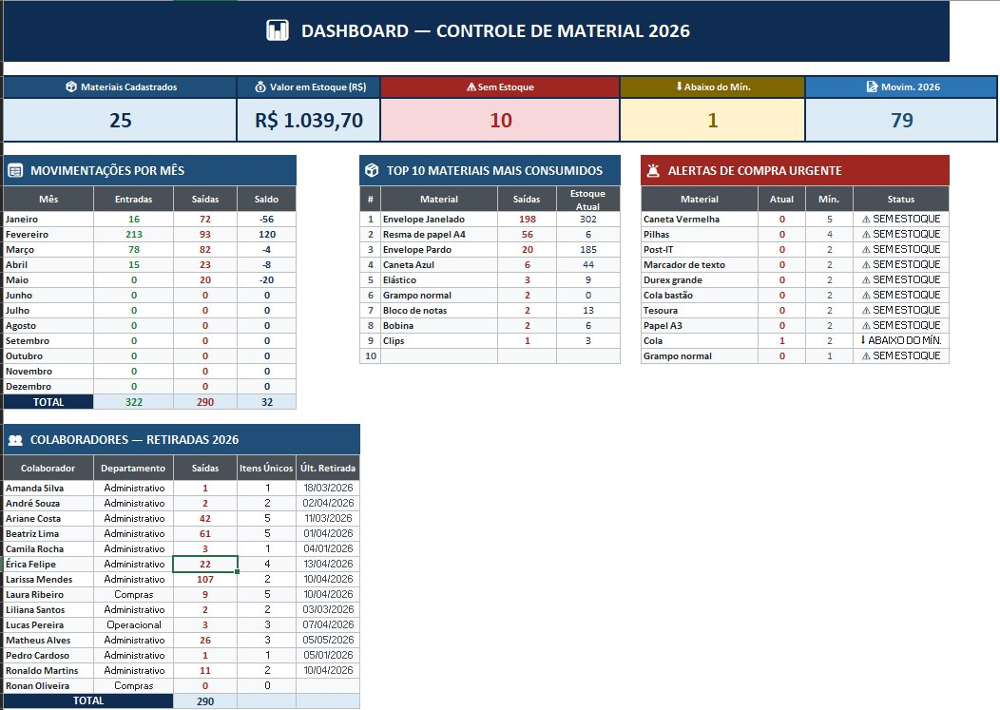
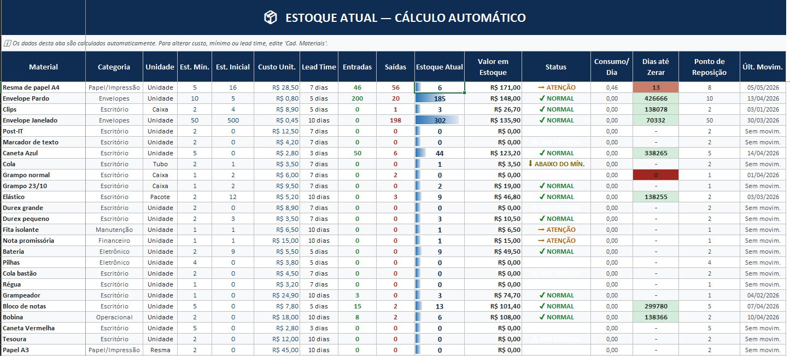

# 📦 Controle de Estoque 2026

Planilha Excel para **gestão automatizada de estoque** de materiais administrativos, com cálculo automático de status, ponto de reposição, valor em estoque e dashboard executivo.

Projeto desenvolvido para uso interno em gestão de almoxarifado e disponibilizado aqui em versão **sanitizada** (dados e nomes reais removidos) como demonstração de habilidades em engenharia de planilhas, automação com fórmulas e visualização de dados.

---

## 📊 Dashboard Executivo

KPIs e visões consolidadas em tempo real:

- **Indicadores principais** — materiais cadastrados, valor em estoque (R$), itens sem estoque, itens abaixo do mínimo, total de movimentações no ano
- **Movimentações por mês** — entradas, saídas e saldo mensal
- **Top 10 mais consumidos** — ranking de materiais com maior saída no ano
- **Alertas de compra urgente** — lista priorizada de materiais que precisam ser repostos
- **Retiradas por colaborador** — quem retirou o quê, quando e quantos itens únicos

---

## 📋 Estoque Atual — Cálculo Automático

Cada material exibe automaticamente:

| Coluna | O que mostra |
|---|---|
| **Entradas / Saídas** | Calculadas a partir do histórico de movimentações |
| **Estoque Atual** | Saldo real com barra de progresso visual |
| **Valor em Estoque** | Quantidade × custo unitário |
| **Status** | `✓ NORMAL` / `→ ATENÇÃO` / `↓ ABAIXO DO MÍN.` / `⚠ SEM ESTOQUE` |
| **Consumo/Dia** | Média de saídas diárias |
| **Dias até Zerar** | Projeção baseada no consumo |
| **Ponto de Reposição** | Calculado a partir do lead time |

---

## ⚙️ Como funciona

1. **Cadastro de Materiais** → cadastra-se cada item com categoria, unidade, custo, estoque mínimo e lead time
2. **Movimentações** → registram-se entradas e saídas com data, colaborador e quantidade
3. **Estoque Atual** → consolida tudo automaticamente via `SOMASES`, `ÍNDICE/CORRESP`, `SE` aninhado e formatação condicional
4. **Dashboard** → resumos automáticos por mês, colaborador, categoria e prioridade

Nenhum campo precisa ser preenchido manualmente nas abas de cálculo — basta lançar movimentação que tudo se atualiza.

---

## 🛠️ Tecnologias e técnicas usadas

- Microsoft Excel — fórmulas avançadas (`SOMASES`, `CONT.SES`, `ÍNDICE/CORRESP`, `SE`, `E`, `OU`)
- Formatação condicional dinâmica (barras de progresso, escalas de cor, ícones de status)
- Validação de dados (listas suspensas para categorias, unidades, colaboradores)
- Estrutura modular escalável para qualquer tipo de inventário (escritório, almoxarifado, TI, manutenção)

---

## 📁 Arquivos do repositório

| Arquivo | Descrição |
|---|---|
| `Controle_de_material_2026_v4_sanitizado.xlsx` | Planilha completa em versão sanitizada |
| `dashboard.png` | Print do dashboard executivo |
| `estoque-atual.png` | Print da aba de cálculo automático |

> 💡 O GitHub não renderiza arquivos `.xlsx` no navegador. Para visualizar a planilha viva, faça download do arquivo `.xlsx` e abra no Excel ou no Google Sheets.

---

## 👤 Autor

**Matheus Mattos** — AI Trainer · Customer Success · Suporte Técnico Bilíngue

